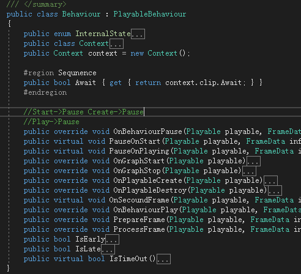

# BaseTimeLine

### 简述
***

UnityTimeline 基础实现,封装了比较方便使用的timeline接口

### API
	使用时需要添加4个类分别继承以下4个基类
	1.	Track
	timeline轨道基类。确定混合器类型并且要显式调用SetContext方法。
	2.	Mixer
	混合器，处理2个clip逻辑融合。每一个track实例对应一个Mixer实例。
	3.	Clip
	4.	Behavior
