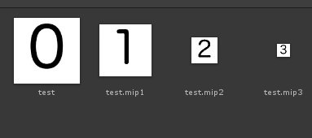

# CustomMipmap <color="red">(Internal)</color>
自定义MipMap
## 简介 
Unity在贴图导入时会自动生成MipMap
但是有的时候，我们需要自己控制生成的贴图。
通过这个导入工具，自动导入我们需要的MipMap
## 使用
1·在贴图同目录下。放置对应MipMap等级的贴图。
2·将Mip图改名成 贴图名.mip(等级)
3·重新导入对应贴图。
