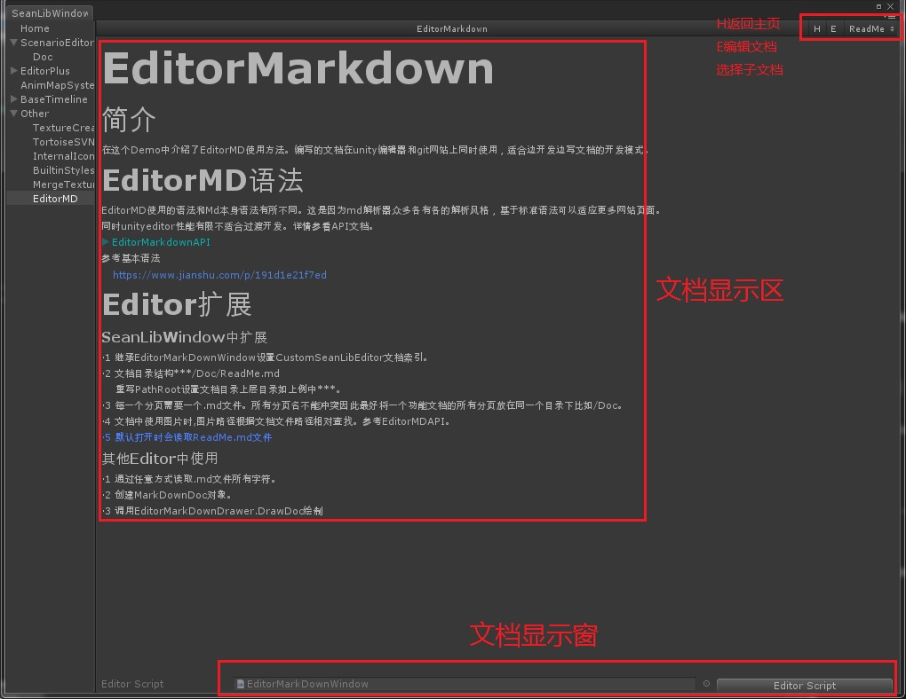
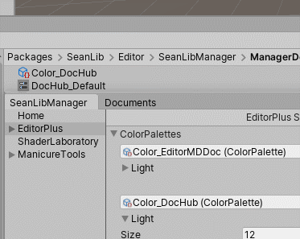
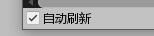

# EditorMarkdown <color="green">(Release)</color>

## 简介 
在这个Demo中介绍了EditorMD使用方法。编写的文档在unity编辑器和git网站上同时使用，适合边开发边写文档的开发模式。
>Version
## EditorMD 语法
EditorMD使用的语法和Md本身语法有所不同。这是因为md解析器众多各有各的解析风格，基于更严格的语法可以适应更多网站页面。
同时unityeditor性能有限不适合过渡开发。详情参看API文档。
>EditorMarkdownAPI
>DocVersionDesign
参考基本语法
(https://www.jianshu.com/p/191d1e21f7ed)
## Editor扩展 
### SeanLibWindow中扩展 
·1 继承EditorMarkDownWindow设置CustomSeanLibEditor文档索引。
·2 文档目录结构***/Doc/Index.md
·3 每一个分页需要一个.md文件。所有分页名不能冲突因此最好将一个功能文档的所有分页放在同一个目录下比如/Doc。
·4 文档中使用图片时,图片路径根据文档文件路径相对查找。参考EditorMDAPI。
·5 默认打开时会读取Index.md文件
## EditorMarkDownWindow 

继承并重写对应方法定制文档显示窗

### 使用 EditorMarkDownWindow 查找功能
·1 打开c#重写脚本中searchfield 关键字
·2 重新打开对应文档
·3 搜索框显示在工具栏右侧

### 使用 ColorPallete 调色板功能

默认使用2种不同用途的调色板。
1·Color_EditorMDDoc 作为默认文档配色。
2·Color_DocHub 在DocHub窗口中显示时使用的配色。
### 使用自定义的调色板
1·找到默认的调色板资源，复制改名放置到自己的目录中。
2·打开c#重写脚本中ColorSettings字段 填写自己的调色板文件名字(不包括后缀名)
3·重新打开文档窗口。

### 自动检测更新显示
在编写md文档是 界面自动更新
1·重写c#脚本 打开EditScript(默认打开)
2·左下角勾选 自动刷新

## CodeTemplate

导入CodeTemplate组件。
右键 Create/CodeTemplate/SeanLibDoc 创建文档索引。注意要在Editor目录中。
打开文档窗口点选对应索引。
点击Create。

## 其他Editor中使用 
·1 通过任意方式读取.md文件所有字符。
·2 创建MarkDownDoc对象。
·3 调用EditorMarkDownDrawer.DrawDoc绘制
