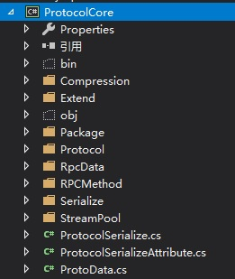
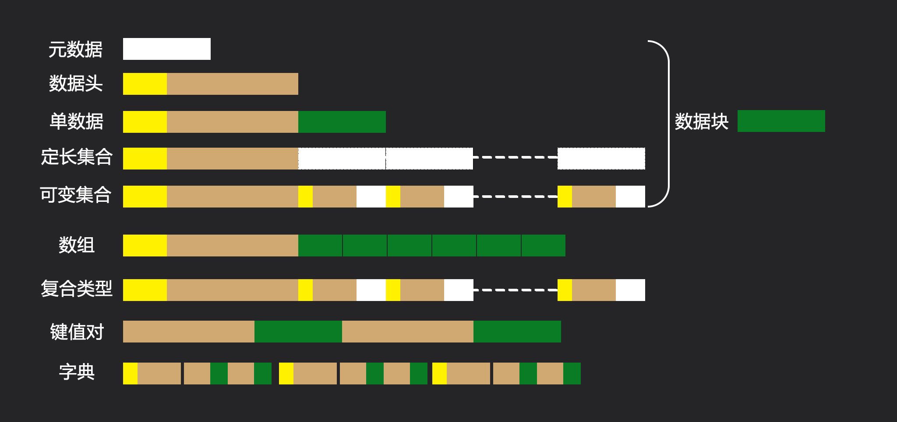

# Protocol<color="orange">(Preview)</color>
协议序列化
## 简介 
自定义的序列化结构。
通过c# 原标签标记序列化字段。提供了扩展接口用来介入序列化逻辑满足各种环境。
客户端服务端通用。
>Version
## 体系结构
最初的设计是为了同一份数据可以无缝在客户端服务端双端同步。
同时为了满足各种类型的网络交互，构建了一套可以在TCP上自解析的MessagePack，
然而后来网络协议这块基本没用到，对象序列化却越走越远。。。

ProtocolCore 协议核心库
---Compression 压缩，目前使用SharpZipLib作为压缩实现
---Extend 对于不同类型的序列化扩展。
---Package 数据分包，数据通过网络传输时的分包签名等结构
---Protocol 协议核心，即数据的编码格式
---RpcData 演示用的RPC数据结构
---RPCMethod 用数据包构建的远程调用流程
---Serialize 序列化核心
---StreamPool 数据操作库
## 数据布局
### 类型
数据块：任何可标识的一组数据。数据块的意义由数据头或者协议文件决定。
数据集合： 复数数据块组合在一起。
数据引用：表明数据是引用而不是实例。采用数据头+引用地址偏移布局+数据类型。<color="red">当前版本未实现</color>
### 布局

<color="white">元数据</color>=[...n]数据任何数据本身的全部字节码。
<color="white">数据头</color>=[32]长度非定长对象都需要数据头标识数据的信息。
序列化数据集=[叶子数据块][叶子数据块][叶子数据块].........[根节点]
## 后续蓝图
0·数据头改版
1·binaryBuffer 彻底放弃stream操作改用自己写的字节控制。
经过简单试验steam操作本身的消耗远大于接口优势。
2·ReferenceObject 引用对象序列化。
序列化引用型对象不再直接按照树形序列化，而是将数据保存在缓存栈中。记录引用地址。
优点
----·完整保留运行时的数据结构
----·对同一个对象被多个其他对象引用时，不会重复序列化。 
----·解决循环嵌套导致的无线递归
3·多态序列化。
支持多态序列化反序列化可以降低逻辑结构的复杂的。
我认为值得牺牲一部分效率做结构型更新。

事实上 只要不是太糟糕的序列化基本都不用太担心效率。因为游戏本身并没有大量的数据IO，实际执行频率是很低的。
而好的序列化结构能减少很多逻辑框架上的数据转换，以及运行时数据管理。这些反而是高频使用的部分，
这个序列化框架的核心还是在设计便利性上而不是性能最大化。
如果要追求超强的性能，不如用zeroformat这类。
